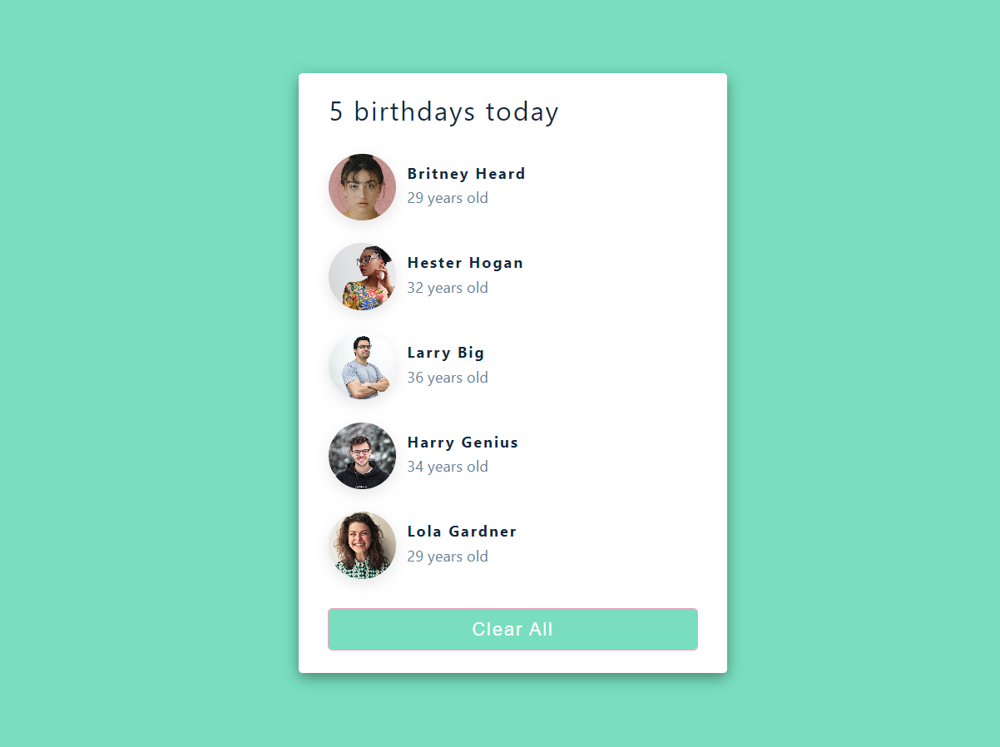

# Getting Started with Create React App

This project was bootstrapped with [Create React App](https://github.com/facebook/create-react-app).

## Summary

`useState` is used to hold the initial state on an array that contain 5 objects(people data). 

`const [people, setPeople] = useState(data)`

Finally when user click the 'Clear All' button, function `setPeople` will change the state into empty array.

`<button onClick={() => setPeople([])}>Clear All</button>`

## Image

In the project directory, you can run:

### `npm install`

Install node_modules 

### `npm start`

Runs the app in the development mode.\
Open [http://localhost:3000](http://localhost:3000) to view it in your browser.
